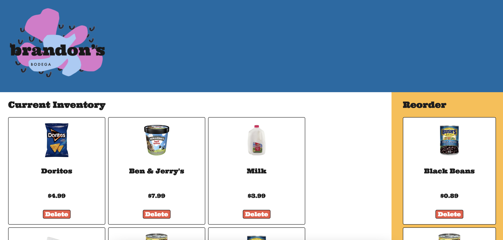

# Brandon's Bodega



Welcome to **Brandon's Bodega**! We may not have everything you want, but we do carry the things Brandon needs in his day-to-day life.

Brandon's Bodega has recently decided to create an internal website for managing the restock of the staple items the store carries. You've been hired to help push the site over the finish line!

## Instructions

For this project, you’ll be building out a React application that displays a
list of current inventory, among other features. Try your best to find the right
places to insert code into the established code base.

Part of what this code challenge is testing is your ability to follow given
instructions. While you will definitely have a significant amount of freedom in
how you implement the features, be sure to carefully read the directions for
setting up the application.

## Setup

1. Run `npm install` in your terminal.
2. Run `npm run server`. This will run your backend on port `8001`.
3. In a new terminal, run `npm start`.

Make sure to open [http://localhost:8001/inventory](http://localhost:8001/inventory) in
the browser to verify that your backend is working before you proceed!

The base URL for your backend is: `http://localhost:8001`
## Core Deliverables

As a user, I should be able to:

- See all the details of the inventory items rendered in `CurrentInventoryList`.
- Add an inventory item from the current list to the reorder list by clicking on it. The selected inventory item should render in the `ReorderInventoryList` component. The inventory item can be added only **once**. The item **does not** disappear from the `CurrentInventoryList`.
- Remove an inventory item from the reorder list by clicking on it. The inventory item disappears from the `ReorderInventoryList` component.
- Remove an inventory item forever by clicking the delete button at the bottom of the `InventoryItemCard`. This should delete the inventory item both from the backend and from everywhere on the frontend.

### Endpoints for Core Deliverables

#### GET /inventory

Example Response:

```json
[
  {
    "id": 1,
    "image": "./images/doritos.jpeg",
    "name": "Doritos",
    "price": 4.99
  },
  {
    "id": 2,
    "image": "./images/ben-jerry.png",
    "name": "Ben & Jerry's",
    "price": 7.99
  },
  {
    "id": 3,
    "image": "./images/milk.png",
    "name": "Milk",
    "price": 3.99
  }
]
```

#### DELETE /inventory/:id

Example Response:

```json
{}
```
